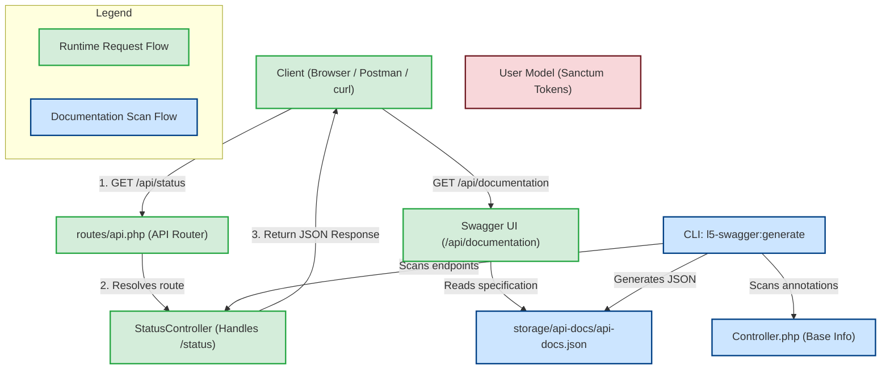

# Laravel API & Swagger Integration: Code Changes & Connection Flow

This document details the components configured in this project, the code changes made, and how these components interact to power your API and generate interactive Swagger documentation.

---

## 1. Connection Flow (How it fits together)

The diagram below shows the runtime request flow (in green) and the compile-time Swagger documentation generation flow (in blue).



---

## 2. Explanation of Code Changes

Here is a breakdown of the files that were modified or created, and their roles in the system:

### 1. `routes/api.php` (API Router)
* **Path**: [routes/api.php](file:///d:/personal%20project/laravel%20test/routes/api.php)
* **What it does**: This file registers your API-specific endpoints. 
* **The Change**:
  * Registered the `/status` route.
  * Pointed it to the `StatusController` and its `getStatus` method:
    ```php
    Route::get('/status', [StatusController::class, 'getStatus']);
    ```
* **Connection**: When a request comes in for `http://127.0.0.1:8000/api/status`, the router acts as a post office and redirects the request execution to `StatusController@getStatus`.

---

### 2. `app/Http/Controllers/Controller.php` (Base Controller)
* **Path**: [app/Http/Controllers/Controller.php](file:///d:/personal%20project/laravel%20test/app/Http/Controllers/Controller.php)
* **What it does**: The base class from which all controllers inherit.
* **The Change**: Added base OpenAPI attributes defining the API info and server location:
  ```php
  #[OA\Info(
      title: "Laravel API Backend",
      version: "1.0.0",
      description: "API documentation for Laravel Backend"
  )]
  #[OA\Server(
      url: "http://127.0.0.1:8000/api",
      description: "Local Development API Server"
  )]
  ```
* **Connection**: The Swagger scanner looks here first to identify the metadata (title, version, server URLs) that wraps the entire API documentation. Without these attributes, documentation generation will crash.

---

### 3. `app/Http/Controllers/StatusController.php` (Status Endpoint Controller)
* **Path**: [app/Http/Controllers/StatusController.php](file:///d:/personal%20project/laravel%20test/app/Http/Controllers/StatusController.php)
* **What it does**: Contains the business logic for the `/status` endpoint and defines its documentation.
* **The Change**: Created this class and added the `getStatus` method. Applied Swagger attributes:
  * `#[OA\Get]`: Tells Swagger this endpoint uses the `GET` method on `/status`.
  * `#[OA\Response]`: Documents that a success (`200 OK`) returns a JSON object containing a `status` and `message`.
* **Connection**: 
  * **Runtime**: Executed by Laravel when calling `/api/status`.
  * **Documentation**: Analyzed by `l5-swagger` to generate the interactive UI button and schema definitions.

---

### 4. `app/Models/User.php` (User Model)
* **Path**: [app/Models/User.php](file:///d:/personal%20project/laravel%20test/app/Models/User.php)
* **What it does**: Represesents the system user.
* **The Change**: Added `Laravel\Sanctum\HasApiTokens` to the traits used by the class.
  ```php
  use HasApiTokens, HasFactory, Notifiable;
  ```
* **Connection**: Enables Laravel Sanctum capabilities on the user model. This allows you to generate API keys/tokens for user authentication (e.g. `$user->createToken('token-name')`) and protect routes via the `auth:sanctum` middleware.

---

### 5. `config/l5-swagger.php` (Swagger Settings)
* **Path**: [config/l5-swagger.php](file:///d:/personal%20project/laravel%20test/config/l5-swagger.php)
* **What it does**: Configures the behavior, endpoints, and paths for L5-Swagger.
* **The Change**: Published from the package core to local configurations. It maps:
  * Interactive UI route: `/api/documentation`
  * Generated JSON specification route: `/docs`
  * Scanner path: `base_path('app')`
* **Connection**: Instructs `l5-swagger` to search the `app/` folder for files containing `#[OA\...]` attributes when running documentation compilation.
